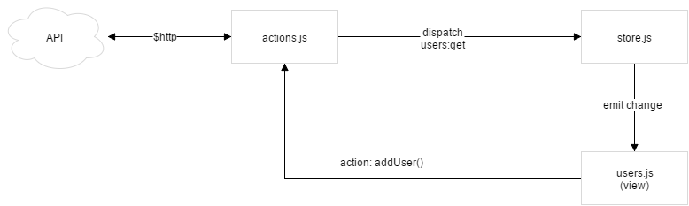

# Angular Flux
## What I learned

- Store could emit **only** an `change` event
- **One** dispatcher for the entire app (singleton)
- Logical code only in stores
- Aync code (call to backend, etc) goes in actions
- Dispatcher could contains a log system to help debugging

## Todos
 - Add another component (like complexe new user validation)
 - Actions and Store in web workers?
 - Fully understand emiter vs dispatcher, code is very similar
 - Develop a base case for store and action to make immutability implicite
 - immutable.js
 
 
## Components
### Users

 