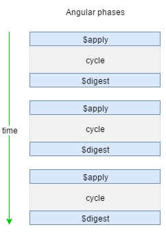
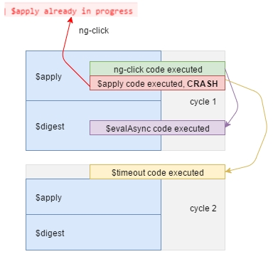
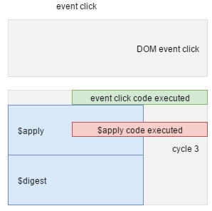
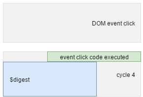
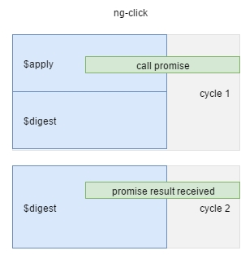
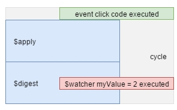
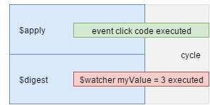

# Angular $digest cycle, a visual guide

## Cycle

Angular is a succession of cycle, each contains 2 phases: $apply and $digest



Angular can detect your changes. If it cannot, then you must call $apply() manually.
If this is not enough, and your changes are still not applied, your last last last solution should be to use $timeout.

**THAT ALL**

If you still getting error: $apply/$digest already in progress, it's simply Angular saying there is something wrong.
You should not "workaround" this error, you have to fix the problem. Because one $digest() or $apply() call, only one
is enough to make your application entering in a $digest soup, and everybody will start to get this error.

Take a look of what both method do:

- $scope.$digest: Execute **only** the $digest phase, executing all watchers.

Angular documentation: _"Usually, you don't call $digest() directly in controllers or in directives. Instead, you should call $apply() (typically from within a directive), which will force a $digest()."_

- $scope.$apply: Evaluate the function given in parameter in the next cycle and **call $rootScope.$digest()**

 Angular documentation: _"$apply() is used to execute an expression in angular from outside of the angular framework. (For example from browser DOM events, setTimeout, XHR or third party libraries"_
 
 ## The Visual Guide
 
 Different use cases that show how it's easy to avoid $apply/$digest already in progress.
 
 ### 1. Complete use case
 
 An use case to understand where is executed when in a cycle
 
 ```
 // HTML
 <button ng-click="toto.click()">ClickMe</button>

 // Javascript
this.click = function() {
	console.debug('ng-click code executed');

	$timeout(function() {
		console.debug('$timeout code executed');
	});

	$scope.$evalAsync(function() {
		console.debug('$scope.$evalAsync code executed');
	});

	// ERROR
	$scope.$apply(function() {
		console.debug('$scope.$apply code executed');
	});
};
 ```
 


- ng-click code is executed in a new cycle, cycle 1
- We are already in an $apply phase, so if you call $apply() you will get an error and calling $digest() is useless because it's the next phase
- $evalAsync is useless
- $timeout code will force Angular to create a new cycle (performance impact)

### 2. Third-party/DOM Events use case

#### Good version
This is the most important point, very often forgot, this is the main cause of a dramatic "... already in progress cascade"

 ```
 // HTML
 <button id="button1">Click outside Angular digest</button>
 ```
 
 ```
 // Javascript
document.querySelector('#button1').onclick = function() {
	console.debug('event click code executed');
	$scope.$apply(function() {
		console.debug('$scope.$apply code executed');
	});
};
 ```
 
 

- DOM event click call our code (it could be any other DOM events or a thirdparty event/callback)
- As you can see $scope.$apply execute a new cycle with our code inside, here it's perfect our code is correctly insecuted in Angular context
- We have both phase: $apply & $digest

#### Things get worse...

So here, is an example of something you should **never** do, using $digest() instead of $apply()

 ```
 // HTML
 <button id="button2">Click outside Angular digest</button>
 ```
 
 ```
 // Javascript
 // NEVER DO THAT
document.querySelector('#button2').onclick = function() {
	console.debug('event click code executed');
	$scope.myValue = 2;
	$scope.$digest();
};
 ```
 


**The $apply() phase is not executed!** It's why Angular strongly recommand to never use $digest()

### 3. In a promise

Using $q, the Angular's promise library, you are sure to be in the Angular context, so no need to $apply or $digest

 ```
 // Javascript
this.ngClick = function() {
	console.debug('call promise')
	asyncGreet().then(function(greeting) {
		console.debug('promise result received');
	})
};
 ```
 
 

Angular create a new $digest only cycle, when the promise is resolved, so if you call $scope.$digest() or $apply() you will get "$digest already in progress"

### 4. In a watcher

Watchers are already in the Angular context, so... 

#### Third party example

An example if you are in a thirdparty, or a DOM event.

 ```
 // Javascript
$scope.$watch('myValue', function(newValue) {
	console.log('$watcher myValue', newValue);
})

document.querySelector('#button2').onclick = function() {
	console.debug('event click code executed');
	$scope.myValue = 2;
	$scope.$apply();
};
 ```
 

 
- You call $apply in the onclick function because you are out of the Angular context  
- In the watcher, never call $apply() or $digest() because you are 100% of the time in a cycle

#### In an angular context

I replace the use case above with an ng-click, so I'm now in the Angular context

 ```
 // HTML
<button ng-click="toto.ngClick()">Click Me</button>
 ```
 
 ```
 // Javascript
 $scope.$watch('myValue', function(newValue) {
	console.log('$watcher myValue', newValue);
})

this.ngClick = function() {
	console.debug('code ng click')
	$scope.myValue = 3;
};
 ```



## Conclusion

1 $digest() is bad, really, never use it  
2 $apply(_your code_) is to execute code that are not executed in the Angular context, like third party library, events dom...  
3 $timeout, $evalAsync, ... try to never use them and trust me, you can  
4 You can avoid 90% of $digest/$apply, the 10 others are only for point #2  
5 Only **one** misused $apply() or $digest() and you start a dramatic cascade of "... already in progress" errors.